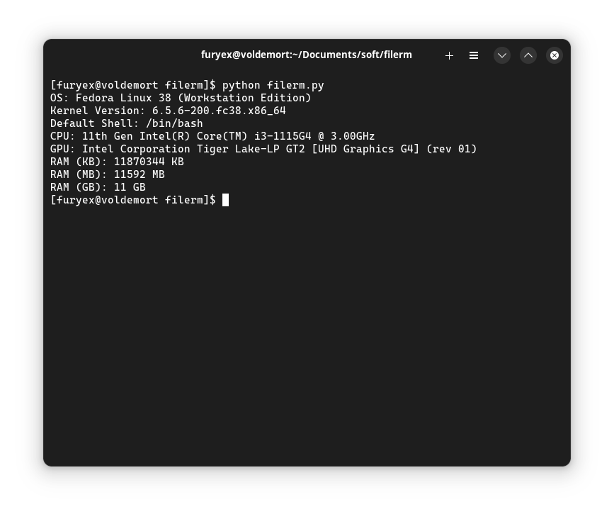

## filerm, reading pc specifications and basic file operations library

### Functions
- OS Information (name, kernel version, shell)
- CPU Information
- GPU Information
- Memory Information (KB, MB, GB)


### Example of Usage:

```py
print("OS: " + filerm.getOS("os-name"))
print("Kernel Version: " + filerm.getOS("kernel"))
print("Default Shell: " + filerm.getOS("shell"))
print("CPU: " + filerm.ReadCPU())
print("GPU: " + filerm.ReadGPU())
print("RAM (KB): " + filerm.ReadMemory("kb"))
print("RAM (MB): " + filerm.ReadMemory("mb"))
print("RAM (GB): " + filerm.ReadMemory("gb"))
```

### Example Output:



#### Filerm licensed under the terms of MIT License.